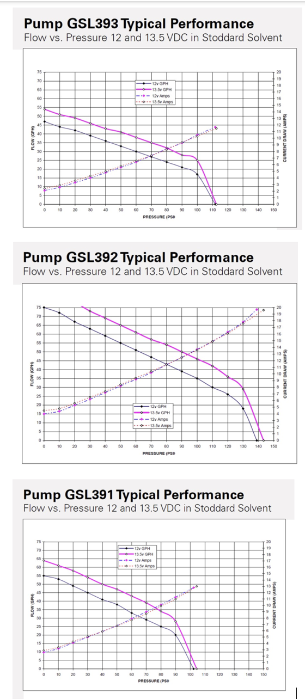

# Fuel System

> ATA Chapter 28 — N720AK Systems Reference

## System Overview

N720AK uses the **EFII System32** electronic fuel injection system with an **Aeromotive MAP-referenced fuel pressure regulator**. This is a modern port EFI system — no venturi, no mechanical fuel injection servo. The fuel system is a pressurized loop: fuel flows from the tanks, through filters and pumps, around a fuel rail past six port injectors, through the regulator, and back to the selected tank via a return line.

**The entire fuel tune — injector pulse widths, fuel maps, mixture scheduling — depends on the regulator maintaining a constant pressure differential across the injectors.** If this differential changes (due to regulator wear, filter clogging, pump degradation, or plumbing restrictions), the ECU's fuel calculations become wrong and the tune must be re-evaluated. Every component in this system exists to ensure that differential stays rock-steady.

---

## Physical Plumbing — Tank to Injector and Back

### Flow Path (supply side)

```
LEFT TANK (30 gal)  ──┐                                    ┌── RIGHT TANK (30 gal)
                       │                                    │
              Safety-wired                         Safety-wired
              shutoff valve                        shutoff valve
                       │                                    │
              40μ pre-filter                        40μ pre-filter
              (TS Flight Lines)                    (TS Flight Lines)
                       │                                    │
                       └──── Under seats ────┬──── Under seats ────┘
                                             │
                                     Andair duplex valve
                                     (tank selection)
                                             │
                                ┌────────────┴────────────┐
                                │                         │
                          Walbro 391 pump           Walbro 391 pump
                          (primary)                 (backup)
                                │                         │
                                └────────────┬────────────┘
                                             │
                                    10μ Aeromotive post-filter
                                    (mounted with 8L clamp to
                                     engine mount diagonal)
                                             │
                                        FUEL RAIL
                                    ┌──┬──┬──┬──┬──┬──┐
                                    │  │  │  │  │  │  │
                                   Cyl injectors (×6)
                                    │
                              End of rail
                                    │
                            ┌───────┴───────┐
                            │               │
                     Fuel pressure    MAP reference line
                      regulator ◄──── (from throttle body
                     (Aeromotive)      orifice port)
                            │
                        RETURN LINE
```

### Flow Path (return side)

```
                        RETURN LINE
                            │
                    Through firewall
                            │
                    Andair duplex valve
                    (routes return to
                     selected tank)
                            │
                  ┌─────────┴─────────┐
                  │                   │
             LEFT TANK           RIGHT TANK
```

### Key Design Points

- **Pressurized loop**: The pumps pressurize fuel continuously. The regulator bypasses excess fuel back to the tank. The injectors pull from a fuel rail that's always at pressure.
- **Dual pumps**: Primary and backup Walbro 391 pumps on a rack. Only one runs at a time. <!-- TODO: confirm — is there a selector switch, or does the ECU control this? -->
- **Two-stage filtration**: 40μ pre-filter before the pumps (protects pumps), 10μ post-filter after the pumps (protects injectors and regulator).
- **MAP reference**: The regulator's vacuum reference comes from an **orifice port on the throttle body** that provides a stable, damped manifold pressure signal. This is a small restrictive fitting — not a wide-open port — to prevent fuel pressure from chasing rapid MAP transients.
- **Return routing**: The return line goes back through the firewall to the Andair duplex valve, which routes it to whichever tank is currently selected. This is a direct run — no additional valving on the return side.

---

## Components

### Fuel Tanks

| Parameter | Value |
|-----------|-------|
| Capacity (each) | 30 gallons |
| Total usable | <!-- TODO: confirm usable vs total --> |
| Fuel type | <!-- TODO: confirm — 100LL? autogas STC? --> |
| Venting | Vented to atmosphere |

### Shutoff Valves

- **Type**: Safety-wired shutoff valves, one per tank
- **Location**: At tank outlet, before pre-filters
<!-- TODO: manufacturer, part number -->

### Pre-Filters (40 micron)

| Parameter | Value |
|-----------|-------|
| Filtration | 40 micron |
| Supplier | TS Flight Lines (private label) |
| Serviceable | Yes — disassemble and clean at annual |
| Location | Between shutoff valve and fuel lines under seats |

<!-- TODO: part number, photo of filter element clean vs dirty -->
<!-- TODO: cleaning procedure — what solvent? what does contamination look like? -->

### Andair Duplex Valve

- **Function**: Tank selector — routes supply from selected tank to pumps, routes return back to selected tank — [spec sheet](https://drive.google.com/file/d/1TO7RCdpZOgreSY4K-vvESaSB53YH2IE8/view)
- **Location**: Under seats, where fuel lines from both tanks converge
- **Note**: Required 90-degree angle fittings to make the plumbing work in the installation
<!-- TODO: model number, 90-degree fitting sizes/part numbers, photo -->

### Fuel Pumps — Walbro 391

| Parameter | Value |
|-----------|-------|
| Model | Walbro GSL391 (391 LPH) |
| Quantity | 2 (primary + backup) |
| Mounting | Pump rack from ProTec Performance, supplied by EFII |
| Pressure | <!-- TODO: confirm rated output pressure --> |



**Pump replacement notes:**

Viton crush washers for pump fittings: [One Hydraulics SS9500-02V](https://www.onehydraulics.com/products/ss9500-02v) (primary source, where N720AK's were purchased). Alternate source: [Titan Fittings SS-9500V series](https://www.titanfittings.com/adapters-and-fittings/hydraulic-adapters/stainless-hydraulic-fittings/stainless-british-and-metric-fittings/ss-9500v).
<!-- TODO: What does it take to change these pumps? How long, what tools? -->
<!-- TODO: Photos of pump internals — what does a healthy pump look like? -->
<!-- TODO: How to tell when pumps need replacement (pressure test? flow test?) -->

### Post-Filter (10 micron) — Aeromotive

| Parameter | Value |
|-----------|-------|
| Brand | Aeromotive |
| Part number | [12347](https://www.summitracing.com/parts/AEI-12347) |
| Filtration | 10 micron |
| Type | Performance post-filter, serviceable |
| Mounting | 8L clamp on engine mount diagonal tube, firewall forward |

<!-- TODO: photo of mounting location -->
<!-- TODO: photo of filter element clean vs dirty -->
<!-- TODO: cleaning/replacement procedure -->
<!-- TODO: what does contamination at the post-filter mean? (pump wear? tank debris?) -->

### Fuel Rail

- **Configuration**: Common rail feeding all 6 cylinders
- **Injectors**: 6 port fuel injectors, one per cylinder
<!-- TODO: injector part number, flow rating, spray pattern -->
<!-- TODO: fuel rail part number, manufacturer -->

### Fuel Pressure Regulator — Aeromotive

| Parameter | Value |
|-----------|-------|
| Brand | [Aeromotive](https://drive.google.com/file/d/13bJWKnxcHvWAUyjMiJIyC8b71120oKtl/view) |
| Type | MAP-referenced diaphragm regulator with bypass return |
| Location | End of fuel rail |
| MAP reference | Orifice port on throttle body |
| Spring setpoint | ~35 PSI differential |
| Part number | 13129 |

The regulator is the heart of fuel pressure management. See [The MAP-Referenced Regulator](#the-map-referenced-regulator) for full theory.

### MAP Reference Line

The vacuum reference line connects from an **orifice port on the throttle body** to the regulator. The orifice provides a stable, damped manifold pressure signal — it's a small restrictive fitting, not a wide-open port. This prevents the regulator from chasing rapid MAP transients during throttle changes.

<!-- TODO: orifice size, line diameter, line material, routing path -->
<!-- TODO: photo of throttle body orifice fitting -->

### Fuel Pressure Sensor — Dynon Kavlico

| Parameter | Value |
|-----------|-------|
| Brand | Kavlico (Dynon-supplied) |
| Range | 150 PSI |
| Type | Gauge (measures relative to atmosphere) |
| Baro compensation | Yes — atmospheric vent port keeps gauge reading accurate with altitude |
| Location | <!-- TODO: where is it tapped into the fuel rail? --> |

See [Dynon Service Bulletin 120414](https://dynonavionics.com/bulletins/support_bulletin_120414.php) regarding blocked baro compensation ports on sensors manufactured July 2013 – June 2014.

### Fuel Lines

<!-- TODO: This section needs:
  - Supplier name and contact
  - Line type (AN size, material — stainless braided? PTFE?)
  - Lengths for each run:
    - Tank to shutoff valve (L and R)
    - Shutoff valve to pre-filter (L and R)
    - Pre-filter to duplex valve (L and R)
    - Duplex valve to pump rack
    - Pump rack to post-filter
    - Post-filter to fuel rail
    - Fuel rail to regulator (integral?)
    - Regulator to firewall passthrough
    - Firewall to duplex valve (return)
    - Duplex valve to tank (return, L and R)
  - AN fitting sizes at each connection
  - Any adapters or reducers
  - Torque specs for AN fittings
  - Photos of routing
-->

---

## How It Works: The MAP-Referenced Regulator

### How It Maintains Constant Differential

The Aeromotive regulator is a mechanical diaphragm device:

- **One side** of the diaphragm sees **fuel pressure** from the fuel rail
- **Other side** sees **manifold pressure** (via a vacuum reference line from the throttle body) plus a **calibrated spring**

The diaphragm balances these forces:

```
Fuel_absolute = MAP_absolute + Spring_force
```

When MAP rises (throttle opened), the diaphragm sees more pressure on the reference side, so it allows fuel pressure to rise by the same amount. When MAP drops (throttle closed), fuel pressure drops to match. This is called **1:1 tracking** — every PSI change in MAP produces a matching PSI change in fuel pressure.

**The result:** The spring force sets the differential, and it stays constant:

```
Fuel_absolute − MAP_absolute = Spring_force ≈ 35 PSI (constant)
```

### What Goes Wrong

| Problem | Signature in Data | Likely Cause |
|---------|-------------------|--------------|
| **MAP under-tracking** | Negative MAP slope (PSI/inHg) | Restricted/leaking vacuum reference line, stiff diaphragm, weak spring |
| **Flow-dependent droop** | Negative fuel flow slope (PSI/(gal/hr)) | Spring fatigue, excessive diaphragm friction |
| **Sticking / hunting** | High residual σ after removing MAP trend | Diaphragm friction, valve seat wear, debris, hysteresis |
| **Over-tracking** | Positive MAP slope | Unlikely — would indicate reference line amplifying signal |

---

## The Critical Quantity: Injector Differential Pressure

The pressure drop across each fuel injector determines how much fuel flows during the injector's open time:

```
True_differential = Fuel_absolute − MAP_absolute
```

For N720AK, this should be **constant at ~35 PSI** regardless of throttle position, altitude, or flight phase.

### Why It Matters

The EFII ECU calculates injector pulse width assuming a known, constant pressure differential. If the differential changes:

- **Higher differential** → more fuel per pulse → richer mixture → wasted fuel, fouled plugs, potentially hydraulic lock
- **Lower differential** → less fuel per pulse → leaner mixture → hot cylinders, detonation risk, rough running

**All fuel tuning depends on this value being stable.** If the differential changes — due to regulator wear, filter clogging, pump degradation, or plumbing restrictions — the fuel maps become wrong and must be re-evaluated.

### What Changes the Differential

| Change | Effect on Differential | What You'd See |
|--------|----------------------|----------------|
| **Clogged post-filter** | Pressure drop before rail → lower differential | Delta drops, especially at high fuel flow |
| **Clogged pre-filter** | Reduced flow to pumps → pump can't maintain pressure | Delta drops at high flow, pump noise |
| **Weak/worn regulator** | Doesn't track MAP 1:1, sticking | MAP slope ≠ 0, high residual σ |
| **Restricted MAP reference line** | Regulator sees damped/wrong MAP | MAP slope ≠ 0 (under-tracking) |
| **Leaking MAP reference line** | Regulator sees atmospheric instead of MAP | Delta rises at low MAP (idle), slope positive |
| **Pump degradation** | Can't maintain target pressure at high flow | Delta sags at high power/flow |
| **Injector clog** | Reduced flow through one cylinder | Individual EGT anomaly, not visible in delta |

### Monitoring the Differential Over Time

Track these metrics at each annual or whenever the fuel system is serviced:

1. **Startup fuel pressure** (gauge, engine off, pump on) — this is the spring setpoint
2. **Run the `regulator_diagnostic.py` script** on a representative flight log
3. **Compare against the baseline** in the flight log history table below

If any of these metrics change significantly, investigate before flying further. A change in the differential means the fuel tune is no longer valid.

---

## Sensor Reference Frames

This is the most important subtlety in interpreting fuel system data. **The two sensors measure in different reference frames:**

- **MAP sensor** measures **absolute** pressure (relative to vacuum). 29.92 inHg at sea level on a standard day.
- **Fuel pressure sensor** (Dynon Kavlico) measures **gauge** pressure (relative to local atmosphere). Reads 0 PSI with no fuel pressure at any altitude.

### The Gauge-vs-Absolute Problem

When we naively compute `Fuel_gauge − MAP_psi`, we get:

```
Delta_gauge = Fuel_gauge − MAP_psi
            = (Fuel_absolute − Atmosphere) − MAP_absolute
            = (Fuel_absolute − MAP_absolute) − Atmosphere
            = True_differential − Atmosphere
```

This is **not** the true injector differential. It's offset by atmospheric pressure (~14.7 PSI at sea level, ~10.5 PSI at 9,000 ft).

### Altitude Effect

Atmospheric pressure decreases with altitude:

```
P_atm = 14.696 × (1 − 6.8756×10⁻⁶ × h)^5.2559    [h in feet, P in PSI]
```

| Altitude (ft) | Atmosphere (PSI) | Atmosphere (inHg) |
|---------------|-----------------|-------------------|
| 0 | 14.70 | 29.92 |
| 3,000 | 13.17 | 26.82 |
| 5,000 | 12.23 | 24.90 |
| 7,000 | 11.34 | 23.09 |
| 9,000 | 10.50 | 21.38 |

As you climb, the gauge delta changes even if the regulator is perfect — because `Atmosphere` in the equation above is changing.

### The Correction

To recover the true injector differential:

```
True_differential = Delta_gauge + P_atm(altitude)
                  = Fuel_gauge − MAP_psi + P_atm(altitude)
```

### Dynon Baro Compensation

Dynon's Kavlico fuel pressure sensor has **baro compensation** — an atmospheric vent port that keeps the gauge reading accurate as altitude changes. This does NOT convert the reading to absolute; it just ensures the gauge reading is a faithful measurement of `Fuel_absolute − Atmosphere` at any altitude.

The baro compensation means the sensor is a good gauge sensor, but it doesn't eliminate the need for the altitude correction when computing the true injector differential. The correction is required because of the reference frame mismatch between the gauge fuel pressure sensor and the absolute MAP sensor.

**Caveat — Dynon Service Bulletin 120414:** Some Kavlico sensors manufactured July 2013 – June 2014 had a blocked baro compensation port (environmental seal covering the vent). This causes the sensor reading to drift ~0.5 PSI per 1,000 ft of altitude change. Test by removing the silicone gasket from the connector and checking if altitude-dependent drift decreases. See: https://dynonavionics.com/bulletins/support_bulletin_120414.php

### When to Apply Altitude Correction

| Sensor Type | Correction | How to Identify |
|-------------|-----------|----------------|
| **Gauge (baro-compensated, like Dynon)** | `+ P_atm(pressure_altitude)` | Reads 0 with no fuel pressure; has baro vent port |
| **Gauge (not compensated, like Garmin)** | `+ P_atm(pressure_altitude)` | Same correction applies |
| **Absolute sensor** | None needed | Reads ~14.7 PSI with no fuel pressure at sea level |

### How to Test Whether Your Sensor Needs Correction

Use the `--alt-scan` flag on the diagnostic script. It applies a range of correction fractions (0.0 to 1.0) to the altitude term and finds the fraction that minimizes residual sigma:

```bash
uv run --with numpy --with matplotlib python3 scripts/regulator_diagnostic.py /path/to/log.csv --alt-scan
```

- **Fraction ≈ 1.0** → Sensor is gauge, correction needed (e.g., Garmin Kavlico)
- **Fraction ≈ 0.0** → Sensor already behaves as absolute, no correction needed

For Garmin GDU 460 fuel pressure, we confirmed fraction = 1.0 (standard gauge sensor).
For Dynon SkyView fuel pressure on N720AK, we found fraction ≈ 0.0 — this is still under investigation. The regulator noise (σ = 1.4 PSI) may be swamping the altitude signal (~0.4 PSI/1,000 ft). Fix the regulator first, then re-test.

---

## Diagnostics

### Running the Script

```bash
cd ~/code/rv10

# Dynon SkyView log
uv run --with numpy --with matplotlib python3 scripts/regulator_diagnostic.py /path/to/dynon_log.csv

# Garmin log (needs altitude correction)
uv run --with numpy --with matplotlib python3 scripts/regulator_diagnostic.py /path/to/garmin_log.csv --alt-correct

# Multiple flights
uv run --with numpy --with matplotlib python3 scripts/regulator_diagnostic.py flight1.csv flight2.csv

# Altitude correction scan
uv run --with numpy --with matplotlib python3 scripts/regulator_diagnostic.py /path/to/log.csv --alt-scan

# Skip plot (console output only)
uv run --with numpy --with matplotlib python3 scripts/regulator_diagnostic.py /path/to/log.csv --no-plot
```

### Step 1: Load and Filter Data

The script auto-detects Dynon vs Garmin format. It extracts:
- Session time, MAP (inHg), fuel pressure (PSI gauge), fuel flow (gal/hr), pressure altitude (ft)
- **Engine-on filter**: MAP > 15 inHg, fuel pressure > 5 PSI, session time > 5 minutes
- **Steady-state filter**: |dMAP/dt| < 0.05 inHg/sec (throttle not moving)

### Step 2: Compute Delta

```
MAP_psi = MAP_inHg × 0.49115
Delta_gauge = Fuel_PSI − MAP_psi
```

Apply altitude correction if using `--alt-correct`.

### Step 3: Key Metrics

| Metric | What It Measures | Healthy Value |
|--------|-----------------|---------------|
| **Delta σ** | Overall variation in injector differential | < 0.2 PSI |
| **MAP slope** | How well regulator tracks MAP changes (PSI/inHg) | ~0 (±0.02) |
| **Fuel flow slope** | Pressure droop under load (PSI/(gal/hr)) | ~0 (±0.05) |
| **Residual σ** | Scatter after removing MAP trend | < 0.1 PSI |
| **Startup fuel pressure** | Spring setpoint (gauge, at atmospheric MAP) | ~35 PSI |

### Step 4: Bin Analysis

The script divides steady-state data into MAP bins (15–19, 19–22, 22–26 inHg) and computes σ within each bin. High within-bin scatter indicates sticking/hunting independent of the MAP slope.

### Step 5: Diagnostic Plot

The 4-panel plot shows:
1. **Delta vs MAP** — reveals MAP slope and scatter pattern
2. **Delta vs Fuel Flow** — reveals flow-dependent droop
3. **Delta vs Time** (colored by |dMAP/dt|) — reveals sticking events and altitude correlation
4. **Delta histogram** — reveals distribution shape (unimodal = good, bimodal = sticking)

---

## Flight Log Analysis History

### Reference Baseline: N88810 (Healthy Regulator)

Same Aeromotive regulator, EFII System32, Garmin GDU 460 (gauge fuel pressure sensor).
Flight: X05 → KGAD, 2026-02-09. Altitude range: sea level to 6,161 ft.

After altitude correction (confirmed fraction = 1.0 for Garmin sensor):
- **True differential: 35.03 ± 0.08 PSI** — essentially perfect
- **MAP slope: −0.011 PSI/inHg** — essentially zero
- **Fuel flow slope: +0.046 PSI/(gal/hr)** — flat
- **Residual σ: 0.07 PSI**

This proves the Aeromotive regulator CAN perform essentially perfectly with the EFII System32.

### N720AK Flight History

| Date | Duration | Alt Range | Delta σ | MAP Slope | FF Slope | Resid σ | Startup FP | Notes |
|------|----------|-----------|---------|-----------|----------|---------|------------|-------|
| (original) | ~80 min | 4,896–9,001 ft | 1.43 | −0.303 | −0.417 | 1.25 | 35.8 | Worst sticking |
| 2026-01-30 | ~105 min | 4,908–8,791 ft | 0.93 | −0.297 | −0.281 | 0.61 | 32.0 | Moderate sticking |
| 2026-02-25 | ~7 min | 5,200–6,680 ft | 0.93 | −0.298 | −0.168 | 0.18 | 33.0 | Short ground run, minimal sticking |

**Key findings:**
- **MAP slope is consistent at −0.30 PSI/inHg across all flights** — this is a structural characteristic of the regulator, not flight-dependent
- **Sticking/hunting varies dramatically** (residual σ: 0.18 to 1.25) — worse on longer flights with more throttle changes, possibly temperature-dependent
- **Startup fuel pressure varies** (32.0 to 35.8) — may indicate the regulator settles at different stick points on startup

---

## Diagnosis: N720AK Regulator

### Problem 1: MAP Under-Tracking (Slope = −0.30 PSI/inHg)

The regulator does not follow MAP changes on a 1:1 basis. For every 1 inHg increase in MAP, the injector differential drops by 0.30 PSI. Over the 10 inHg operating range, that's ~3 PSI of sag — about 9% of the 33 PSI setpoint.

**Likely causes:**
- Vacuum reference line partially restricted or leaking
- Diaphragm stiffness or age
- Spring rate mismatch

**Effect:** At high power, injectors see less differential than intended → leaner than the ECU expects. At idle, richer than expected. The ECU's fuel map is calibrated assuming constant differential — this slope means the actual air-fuel ratio shifts with power setting.

### Problem 2: Mechanical Sticking / Hunting (Variable, up to σ = 1.25 PSI)

Random, non-repeatable variation in the differential, worst at mid and high power settings, worse on longer flights.

**Likely causes:**
- Diaphragm friction or contamination
- Valve seat wear or debris
- Spring fatigue causing hysteresis

**Effect:** Random variation in fuel delivery per injector pulse → uneven cylinder mixture, potentially rough running.

### Recommendations

1. **Inspect vacuum reference line** — check for kinks, cracks, loose fittings, contamination
2. **Replace or rebuild the regulator** — the sticking won't be fixed by a vacuum line repair
3. **After replacement, re-fly and re-analyze** — target σ < 0.2 PSI and MAP slope near zero
4. **After regulator fix, re-test the baro port question** — with low regulator noise, the altitude signal will be detectable

---

## Open Questions

- **Dynon baro compensation behavior**: Our analysis showed the altitude correction fraction = 0.0 for N720AK, suggesting the Dynon is removing altitude effects internally. But the physics says a baro-compensated gauge sensor should still need the correction. The regulator noise (σ = 1.4 PSI) likely swamps the altitude signal (~0.4 PSI/1,000 ft). Fix the regulator first, re-test with clean data.
- **Startup fuel pressure variation**: 32.0 to 35.8 PSI across flights. Is this temperature-dependent? Different regulator stick points? Pump output variation?
- **Baro port status**: Cannot conclusively test from current flight data. Fix regulator first.
- **Dynon differential display**: Dynon offers a built-in `Fuel_gauge − MAP` differential display, but this shows `True_differential − Atmosphere`, not the true injector differential. It shifts with altitude. Not sufficient for regulator health monitoring without manual altitude correction.

---

## References

- [EFII System32 Installation Manual (Rev 9-13)](https://drive.google.com/file/d/1qWy2YjOcxXDmAfCELyb1E6BdgQzikOnG/view)
- [EFII System32 Installation Manual (Rev 6-19)](https://drive.google.com/file/d/1BESBfApEQT0hh6kc2LZ9ic5jRJH6KIjK/view)
- [EFII System32 Operating Procedures (12-20)](https://drive.google.com/file/d/1DpagY70w5oKBDZ5f50atGQ_gukgIGGgV/view)
- [EFII System32 Fuel Flow & RPM Config (Rev 10-19)](https://drive.google.com/file/d/1u1Z214HEJB2bEiMpFU9ltmSb-CmbR7ft/view)
- [EFII System32 Initial Tuning — CSP (Rev 6-20)](https://drive.google.com/file/d/1P36hbiAgYbXRVSpBjiZAR1q9-bidzpfb/view)
- [EFII System32 Upgrade Installation Manual](https://drive.google.com/file/d/1U_Z8F2wmzUvSQblY9kP-5OzxFby1jM_p/view)
- [Regulator Diagnostic Script](https://github.com/sritchie/rv10/blob/main/scripts/regulator_diagnostic.py) — auto-detects Dynon/Garmin CSV, computes diagnostic metrics, generates 4-panel plot
- [Regulator Diagnostic Plan](https://github.com/sritchie/rv10/blob/main/plans/regulator-diagnostic.md) — workflow for analyzing regulator health
- [Andair FS2020-D2 Duplex Valve Spec Sheet](https://drive.google.com/file/d/1TO7RCdpZOgreSY4K-vvESaSB53YH2IE8/view)
- [Andair FS20 Fuel Selector Data Sheet](https://drive.google.com/file/d/1HITWQ2vGk_ejgl2kyaRrRlyun6pNDlPl/view)
- [Aeromotive 13129 EFI Bypass Regulator Manual](https://drive.google.com/file/d/13bJWKnxcHvWAUyjMiJIyC8b71120oKtl/view)
- [Dynon Service Bulletin 120414](https://dynonavionics.com/bulletins/support_bulletin_120414.php) — blocked baro compensation ports on Kavlico sensors
- Flight log data: `maintenance/fuel-system/flight-logs/`

---

## TODO: Information Needed

### Component Data Sheets and Part Numbers
- [x] Aeromotive regulator — Aeromotive Compact EFI Regulator with 0.020" bypass orifice (ProTek Performance / Robert Paisley)
- [x] Walbro 391 pumps — pump curves filed: [GDrive](https://drive.google.com/file/d/1PUtKLYYYZci6o6Hc7R-wQbSz5pSp8JiM/view), also `images/walbro-gsl391-pump-curves.png`
- [ ] ProTec Performance pump rack — part number, drawing
- [x] Aeromotive post-filter — Aeromotive 12347, 10-micron, serviceable
- [ ] TS Flight Lines pre-filter — part number (or equivalent if private label)
- [ ] Andair duplex valve — model number
- [ ] EFII fuel injectors — part number, flow rating
- [ ] Fuel rail — manufacturer, part number
- [ ] Kavlico fuel pressure sensor — exact Dynon part number, data sheet
- [ ] Shutoff valves — manufacturer, part number

### Fuel Lines
- [ ] Supplier name and contact info
- [ ] Line type (AN size, material — stainless braided PTFE?)
- [ ] Lengths for each run (tank to valve, valve to filter, filter to duplex, duplex to pump rack, pump to post-filter, post-filter to rail, regulator return through firewall, firewall to duplex return, duplex to tank return)
- [ ] AN fitting sizes at each connection
- [ ] Any adapters or reducers in the system
- [ ] Torque specs for AN fittings
- [ ] Photos of routing under seats and through firewall

### Pump Replacement
- [x] Viton crush washers — [Titan Fittings SS-9500V](https://www.titanfittings.com/adapters-and-fittings/hydraulic-adapters/stainless-hydraulic-fittings/stainless-british-and-metric-fittings/ss-9500v)
- [ ] Step-by-step replacement procedure
- [ ] What does it take? Time, tools, access?
- [ ] Photos of pump internals (healthy pump)
- [ ] How to tell when pumps need replacement

### Filter Servicing
- [ ] Pre-filter cleaning procedure (solvent? compressed air?)
- [ ] Post-filter cleaning procedure
- [ ] Photos of clean filter element vs contaminated
- [ ] What does contamination look like? What does it mean?
- [ ] Replacement schedule or inspection criteria

### Photos Needed
- [ ] Overall fuel system routing (overview)
- [ ] Pre-filter location and mounting
- [ ] Post-filter mounted on engine mount diagonal
- [ ] Pump rack
- [ ] Fuel rail and injectors
- [ ] Regulator and MAP reference line connection
- [ ] Throttle body orifice fitting
- [ ] Andair duplex valve
- [ ] Firewall passthrough
- [ ] Clean vs dirty filter elements

### System Questions
- [ ] Fuel type — 100LL only, or autogas STC?
- [ ] Total usable fuel per tank
- [ ] Pump selection — is there a switch, or does the ECU control primary/backup?
- [ ] MAP reference orifice size
- [ ] Fuel pressure sensor tap location on the rail
