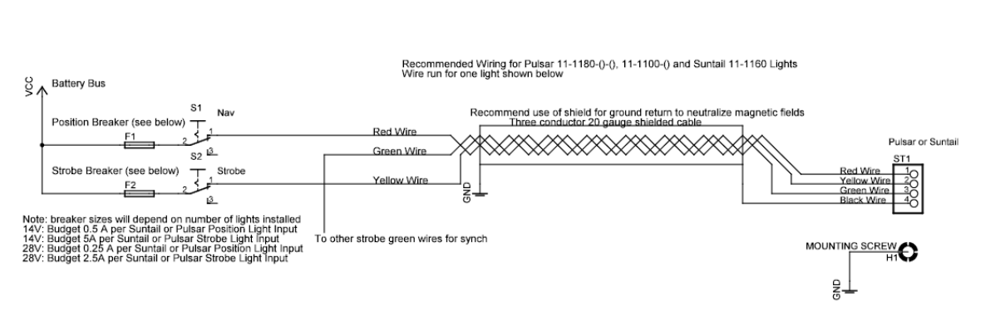
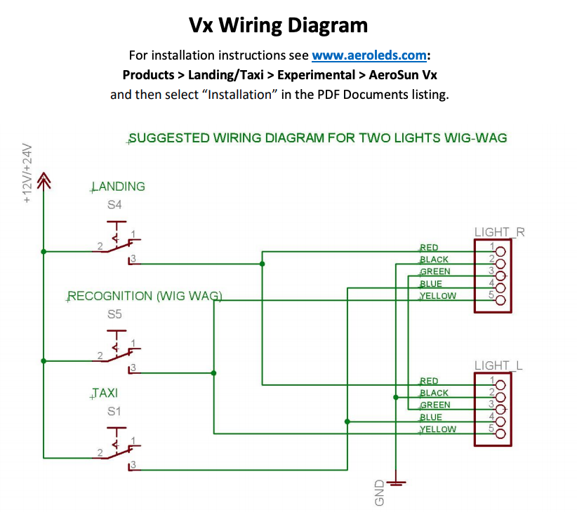

# Lighting

> ATA Chapter 33 — N720AK Systems Reference

## Overview

N720AK uses LED lighting throughout — **AeroLEDs** products in the wingtips and tail. The wingtips are attached with piano hinges for easy removal during maintenance.

## Components

| Component | Part Number | Supplier | Notes |
|-----------|-------------|----------|-------|
| Wing tip lights (x2) | [Pulsar NSP/660](https://drive.google.com/file/d/1onTAIGN8qbuRIdnjjzd__WusWbXLaJkj/view) | AeroLEDs | 3-in-1: position, strobe, rear position |
| Landing/taxi lights (x2) | [AeroSun VX](https://drive.google.com/file/d/1xYeSL_1LVascpJOLFjPU8L3xYtJPENnf/view) | AeroLEDs | Built-in wig-wag mode |
| Tail light | [SunTail](https://drive.google.com/file/d/1T4M9Q_xeSgJWE-ySFvcwcPTa1if7kywT/view) | AeroLEDs | Position (white) + strobe |

### Lighting Controls

| Switch | Function |
|--------|----------|
| NAV | Position lights (wing tips and tail) |
| STROBE | Strobe lights (wing tips and tail) |
| LANDING | Landing lights (wing tips) |
| TAXI | Taxi lights |

## How It Works

Each wingtip contains two units:
- **Pulsar NSP/660**: Combines red/green position light, white strobe, and rear-facing white position light in one housing
- **AeroSun VX**: High-intensity LED landing and taxi light with wig-wag capability

The wingtips attach via **piano hinge modification** — they can be removed entirely for maintenance access to the wing internals.

<!-- TODO: Wig-wag mode — how is it activated? Always on? VPX controlled? -->
<!-- TODO: Power consumption for each light -->

## Wiring

**Wingtip wiring references:**
- [Wing wiring overview](http://www.goodplaneliving.com/wing-wiring/)
- [Grounding block approach](http://www.vansairforce.com/community/showpost.php?p=673363&postcount=4)
- [VAF AeroSun discussion thread](http://www.vansairforce.com/community/showthread.php?t=94927&page=5)
- [Wing light grounding points discussion](http://www.vansairforce.com/community/showthread.php?t=18851)

### Wingtip Connectors (CPC Series 1, 9-Pin)

Each wingtip connects via a CPC barrel connector. Pin assignments are identical left and right.

<!-- TODO: CPC connector part numbers (shell size, pin count, manufacturer P/N) -->
<!-- TODO: CPC pin type and crimp specs -->

| Pin | Function | Wire Color |
|-----|----------|------------|
| 1 | AeroSun VX | Orange |
| 2 | AeroSun VX | Blue |
| 3 | AeroSun VX | White |
| 4 | Pulsar | Orange |
| 5 | Pulsar | Blue |
| 6 | Pulsar | White |
| 7 | AeroSun VX sync | Green |
| 8 | (unused) | — |
| 9 | Ground | — |

The Molex connector on the left wingtip is for the pitot heater (routed through the wing root CPC, not the wingtip CPC).

### Pulsar / SunTail Wiring (Position + Strobe)

Recommended wiring for Pulsar 11-1180 / 11-1100 and SunTail 11-1160. Uses three-conductor 20 AWG shielded cable. Shield is used for ground return. Green sync wires from all strobe lights connect together for synchronized flashing.

**Pulsar/SunTail connector (ST1):**

| Pin | Wire | Function |
|-----|------|----------|
| 1 | Red | Position (nav) power |
| 2 | Yellow | Strobe power |
| 3 | Green | Sync |
| 4 | Black | Ground (shield) |

Ground via mounting screw (H1).

**Current budget (14V system):**
- Position light input: 0.5A per Pulsar/SunTail
- Strobe light input: 5A per Pulsar/SunTail

### AeroSun VX Wiring (Landing / Taxi / Wig-Wag)

Two-light wig-wag configuration. Each AeroSun VX has a 5-wire connection:

| Wire | Function |
|------|----------|
| Red | Landing power |
| Black | Ground |
| Green | Recognition (wig-wag) power |
| Blue | — |
| Yellow | Taxi power |

Three switches control the pair:
- **S4** (Landing) — both lights steady on
- **S5** (Recognition / wig-wag) — alternating flash
- **S1** (Taxi) — both lights at reduced intensity

See also: [Wing root connector pinouts](sys-24-electrical.md#wing-root-connectors-cpc) in the Electrical reference for the full wing-to-fuselage wiring.

<!-- TODO: Piano hinge connector — what type? Quick-disconnect? -->
<!-- TODO: Tail light wiring routing -->

## Inspection & Maintenance

<!-- TODO: LED inspection — what to look for -->
<!-- TODO: Piano hinge lubrication -->
<!-- TODO: Connector inspection and cleaning -->

## References

- [AeroLEDs Pulsar NS Installation (Experimental)](https://drive.google.com/file/d/1onTAIGN8qbuRIdnjjzd__WusWbXLaJkj/view)
- [AeroLEDs AeroSun VX Installation (Rev C)](https://drive.google.com/file/d/1xYeSL_1LVascpJOLFjPU8L3xYtJPENnf/view)
- [AeroLEDs SunTail Installation (Rev A)](https://drive.google.com/file/d/1T4M9Q_xeSgJWE-ySFvcwcPTa1if7kywT/view)
